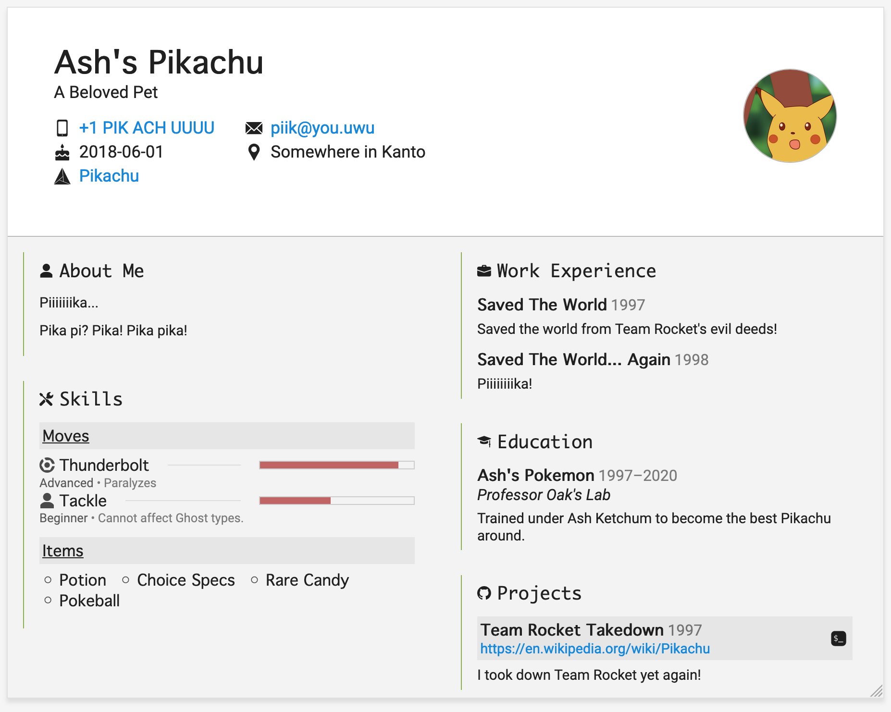

# Resume
This is the static "site" generator that builds my HTML résumé.


## Features

- 100% professional-quality resume created from HTML and CSS.
- Single page.
- No JavaScript required.
- Responsive design:
  - 2-column desktop layout.
  - Mobile layout for small screen devices.
  - Print layout for creating PDFs.


## Usage

This generator compiles a resume made from SCSS and Pug templates.
Each section of the resume is generated separately and then combind with a wrapper to create the final product. 


### Configuration

User-supplied data is provided through a `me.toml` file. To get you started, an example has been provided as `me.example.toml`.


### Building

Building is done by [Gulp](https://gulpjs.com/).

```bash
npm install
npx gulp
```

The final resume file will be available under `build/artifacts`.


## Preview

|||
|:-:|:-:|
|**Desktop**|**Mobile**|
